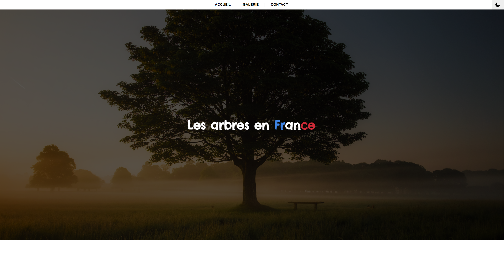

# Site Web Arbre

## Présentation :

C'est un petit site web qui présente quelques espèces d'arbres en France. C'est un petit projet qui a été fait dans le but de mettre un bouton "Mode sombre" histoire de m'entraîner.

## Langage :

Le site a été codé avec les langages suivants :
* HTML
* CSS
* JAVASCRIPT

## Exemple d'interface du site :

